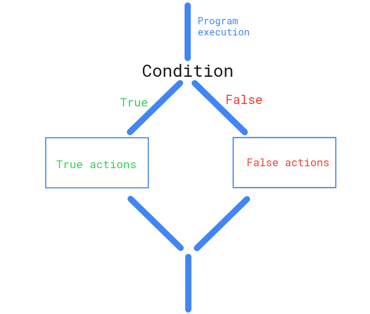

# JavaScript Conditionals
Almost in every programming language conditionals exist. 

Conditional statements are the fundamentals to control the flow of a program and enabling the dynamic nature of a program.

### Example
```powershell
A program that decide the process of CNIC based on age. Just like there will be two scenarios one for below from 18 and second is for above 18.

<--- 18 | create a smart cnic - require parent consent - require child consent - require card creation purpose - etc process related to child

18 ---> | create a smart cnic - require parent consent - etc process related to adult

Now in this scenario the entrance is one and then it will divide into two parts then each part have own output.
```

## Conditional Statements
Conditional statements are used to decide to do something based on some condition.
Conditional Statements are responsible to run the specific block of code.

> Here statements mean any line of JAVASCRIPT code that does something.

In JavaScript, we have different types of conditional statements:

- `if` statement
- `if else` statement
- `if else if` statement
- `switch` statement
- `ternary` operator



## If statement
If statement is used to decide to do something based on some condition. if condition is true then it will execute the block of code.

```js
if (condition) {
    // code to be executed if condition is true
}
```

## if else statement
Else statement is used to decide to do something based on some condition. if condition is false then it will execute the block of code or if the `if condition` is false then it will execute the else block of code.

```js
if (condition) {
    // code to be executed if condition is true
} else {
    // code to be executed if condition is false
}
```

## If else if statement
This is similar to the `if else statement` but in `if else if statement` we can have multiple conditions, mean we can check multiple conditions before else block of code.

```js
if (condition1) {
    // code to be executed if condition1 is true
} else if (condition2) {
    // code to be executed if condition1 is false and condition2 is true
} else {
    // code to be executed if both condition1 and condition2 are false
}
```

## Switch statement
In switch we only pass one variable and check the value of that variable with multiple cases.

```js
let variable = "value";
switch (variable) {
    case "value1":
        // code to be executed if variable is equal to value1
        break;
    case "value2":
        // code to be executed if variable is equal to value2
        break;
    default:
        // code to be executed if variable is not equal to any of the cases
}
```

In switch statement the `break` keyword is used to stop the code from running after that matching condition in switch body.

Mean if the our condition is match with the second case then we not need to check third and so on condition further. So break keyword is used to prevent/stop the code from running after that and get out from switch statement.

## Ternary operator
Ternary Operator also check the conditions similar to `if else` statement but instead of using `if else` we can use ternary operator.

A ternary operator which require three operands.

1. condition
2. code to be executed if condition is true
3. code to be executed if condition is false

### Syntax
```js
condition 
? expression to be executed if condition is true 
: expression to be executed if condition is false
```

```js
let age = 18;

age >= 18 ? console.log("You are eligible to vote") : console.log("You are not eligible to vote");
```

#### Similar in `if else`
```js
if (age >= 18) {
    console.log("You are eligible to vote");
} else {
    console.log("You are not eligible to vote");
}
```


