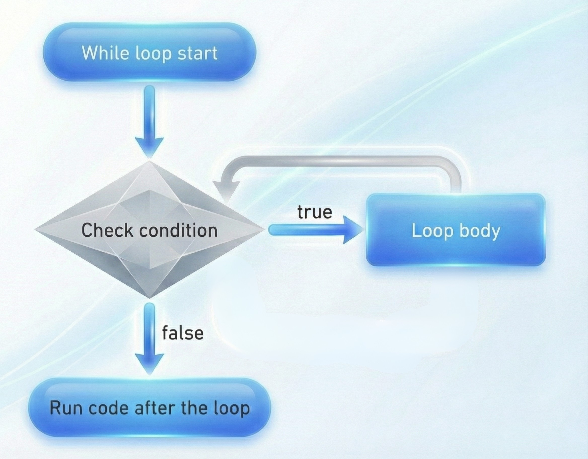

# Loops

In programming, a loop is a statement that allows us to run code multiple times.
e.g. we need to `console.log` the numbers from 1 to 10.

### Definition

A loop is a control flow statement that allows a block of code to be executed or run repeatedly based on a specified condition or for a predefined number of iterations.

A loop is just like a circle or starting a car race from Point `A` — the car runs and comes again to Point `A` again and again until it is stopped manually.

<figure>
    
    <figcaption>Loop</figcaption>
</figure>

## Types of Loops

In programming, we have three major types of loops:

* `for` loop
* `while` loop
* `do-while` loop

## For loop

A for loop is a simple loop that repeats a block of code a specified number of times.

e.g. in the below code, we need to print the numbers from 1 to 10, where the number of times is 10.

### Syntax

```js
for (let i = 0; i < 10; i++) {
   // code
   console.log(i); 
}
```

> ### For Loop flow
>
> 1. Initialize the variable (this step is executed only once before the loop starts)
> 2. Check the condition
> 3. Execute the code
> 4. Update the variable
> 5. Repeat the process until the condition is false
>
> The repeating steps are `2`, `3`, and `4` until the condition becomes false.

<figure>
    
    <figcaption>For Loop</figcaption>
</figure>

## While loop

A while loop is like a circle — it repeats a block of code until the condition becomes false.

### Syntax

```js
while (true) {
    console.log("Hello");
}
```

> ### While loop flow
>
> 1. Check the condition
> 2. Execute the code
> 3. Repeat the process until the condition is false

<figure>
    
    <figcaption>While Loop</figcaption>
</figure>

## Do-While loop

A do-while loop is almost the same as a while loop — it repeats a block of code until the condition is false, but the difference is that it will execute the loop body at least once before checking the condition.

### Syntax

```js
do {
    console.log("Hello");
    // code
} while (condition);
```

> ### Do-While loop flow
>
> 1. Execute the code
> 2. Check the condition
> 3. Repeat the process until the condition is false

<figure>
    
    <figcaption>Do-While Loop</figcaption>
</figure>

## For in loop

A `for in` loop is like a for loop, but it is used to loop over the properties of an object.

A simple for loop is used for arrays and strings, but for objects, we need to use a `for in` loop.

### Syntax

```js
for (let key in obj) {
    // code
    console.log(key);
}
```

## For of loop

A `for of` loop is like a simple for loop, but it goes through all the values of an iterable object.

### Syntax

```js
for (let value of array) {
    // code
    console.log(value);
}
```

## Difference between `simple for loop` and `for of loop`
| **Simple for loop**                          | **for of loop**                                |
| -------------------------------------------- | ---------------------------------------------- |
| Accesses elements using the **index**        | Accesses elements using the **value**          |
| Allows us to access elements by index        | Goes through all values of an iterable object  |
| We know exactly which index we are accessing | We don't know the index of the current element |