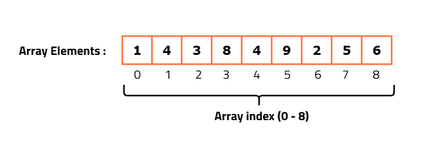

# Arrays
Collections of **elements** / **values** stored in a single variable. 

- In JavaScript, an array can hold different data types.

- Arrays are **mutable**, which means we can change the values inside them.

- In JavaScript, arrays are objects, but instead of key-value pairs they use numbered indexes to store values.

> - **typeof(arr)** returns "object".

### Syntax

```js
let arrayName = [value1, value2, value3];
```

### Examples

```js
let colors = ["red", "green", "blue"];
let numbers = [1, 2, 3, 4, 5];
let mixed = ["red", 1, "green", 2, "blue", {a: 1, b: 2}];
```

## Array Indices
Elements in array stored in linear order.
Each element in an array has an **index number**, starting from **0**.



## Array Properties

### length

Returns the number of elements in the array.

```js
let colors = ["red", "green", "blue"];
console.log(colors.length); // 3
```

---

# Array Methods

Some array methods modify the original array, while others return a new one.

Below are the commonly used methods, grouped in a logical order.

## 1. Add / Remove Elements

### **push()** – Adds an element to the end of the array.

```js
let colors = ["red", "green"];
colors.push("blue");
console.log(colors); // ["red", "green", "blue"]
```

### **pop()** – Removes the last element from the array.

```js
let colors = ["red", "green", "blue"];
colors.pop();
console.log(colors); // ["red", "green"]
```

---

## 2. Create New Arrays (Non-Destructive)

### **slice()** – Returns a portion of the array as a new array.

```js
let colors = ["red", "green", "blue"];
let part = colors.slice(0, 2);
console.log(part); // ["red", "green"]
```

### **concat() – Combines arrays and returns a new one.**

```js
let a = [1, 2];
let b = [3, 4];
console.log(a.concat(b)); // [1, 2, 3, 4]
```

### **map() – Creates a new array by modifying each element.**

```js
let nums = [1, 2, 3];
let doubled = nums.map(n => n * 2);
console.log(doubled); // [2, 4, 6]
```

### **filter() – Returns elements that match a condition.**

```js
let nums = [1, 2, 3, 4];
let even = nums.filter(n => n % 2 === 0);
console.log(even); // [2, 4]
```

---

## 3. Searching / Checking

### **find()** – Returns the first element that satisfies a condition.

```js
let colors = ["red", "green", "blue"];
console.log(colors.find(c => c === "green")); // "green"
```

### **includes()** – Checks if an element exists in the array.

```js
console.log(["a", "b"].includes("a")); // true
```

---

## 4. Looping / Iteration

### **forEach()** – Loops through each element in the array.

```js
["a", "b", "c"].forEach(x => console.log(x));
```

### **reduce()** – Reduces the array to a single value.

```js
let nums = [1, 2, 3];
let sum = nums.reduce((a, b) => a + b);
console.log(sum); // 6
```

---

## 5. Sorting / Ordering

### **sort()** – Sorts the array alphabetically or numerically.

```js
let colors = ["blue", "red", "green"];
colors.sort();
console.log(colors); // ["blue", "green", "red"]
```

---

## 6. Conversion Methods

### **join()** – Converts array into a string with a separator.

```js
let colors = ["red", "green"];
console.log(colors.join("-")); // "red-green"
```
---

For more info or methods visit: [MDN](https://developer.mozilla.org/en-US/docs/Web/JavaScript/Reference/Global_Objects/Array)

---