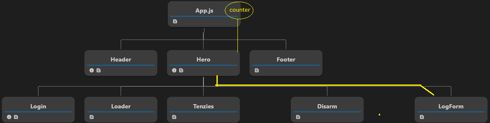
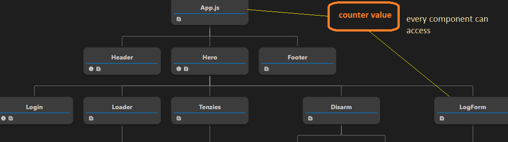

# Context API

As of now, we know that passing props to a component is simple and easy for **small applications**.
But when your app **grows bigger**, and especially when components have a **deep hierarchy**, passing props becomes a **headache**. This problem is known as **props drilling**.

## The Problem (Props Drilling)

Let’s understand the problem with an example.

Assume we have a **counter value** that is stored in `App.jsx`, and this value is required in multiple components.



From the diagram above 👆

- `App.jsx` contains the **counter**
- `LogForm` component needs the counter value
- But `Header`, `Hero`, and `Footer` **do not need** the counter

Still, to reach `LogForm`, we must pass the counter like this:

```
App.jsx → Hero.jsx → LogForm.jsx
```

Here:

- `Hero.jsx` is **holding the counter only to pass it forward**
- This makes code messy and hard to maintain

This is where **Context API** comes into the picture.

## What is Context API?

Context API allows us to create a **global store** that can be accessed by **any component** directly, without passing props manually at every level.

So instead of passing the counter through multiple components:

- We store it in **Context**
- Any component that needs it can directly access it



## How to Create Context API Store?

### 1. Create Context

First, we create a context using `createContext`.

```jsx
import { createContext } from "react";

export const CounterContext = createContext();
```

### 2. Provider

`Provider` is used to wrap the components that need access to the shared data.
It provides the global data to all child components.

```jsx
import { CounterContext } from "./CounterContext";
import { useState } from "react";

function App() {
  const [counter, setCounter] = useState(0);

  return (
    <CounterContext.Provider value={{ counter, setCounter }}>
      <Hero />
    </CounterContext.Provider>
  );
}

export default App;
```

Now:

- `Hero`, `LogForm`, and all child components can access `counter`
- No unnecessary prop passing

### 3. useContext Hook

To read or update the context data, we use the `useContext` hook.

```jsx
import { useContext } from "react";
import { CounterContext } from "./CounterContext";

function LogForm() {
  const { counter, setCounter } = useContext(CounterContext);

  return (
    <>
      <h2>Counter Value: {counter}</h2>
      <button onClick={() => setCounter(counter + 1)}>Increment</button>
    </>
  );
}

export default LogForm;
```

Now `LogForm` can directly access the counter without depending on `Hero`.

# Docs references

- [context api](https://react.dev/reference/react/createContext)
- [useContext](https://react.dev/reference/react/useContext)