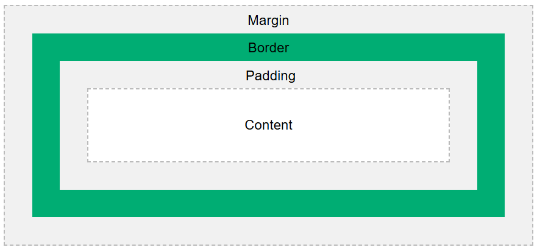

# **Box Model (CSS)**

In CSS, every element is treated like a box. 
This box has **4 parts**:

1. **Content** – The actual text or image inside the box.
2. **Padding** – Space inside the box, around the content.
3. **Border** – A line around the padding (optional).
4. **Margin** – Space outside the box, separating it from other elements.

📎 [More info on Box Model](https://www.w3schools.com/css/css_boxmodel.asp)

---

## **CSS Units**

CSS units define **sizes** (like width, height, font-size, etc.).
There are two types:

### **Relative Units** (Change based on screen or parent)

* `%` – Based on parent element
* `em` – Based on element’s font size
* `rem` – Based on root font size (`html` element)
* `vw` – 1% of the browser width
* `vh` – 1% of the browser height
* `vmin` – 1% of the smaller side (width or height)
* `vmax` – 1% of the larger side

---

### **Absolute Units** (Fixed size, don’t change)

* `px` – Pixels (standard unit on screens)
* `cm` – Centimeters
* `mm` – Millimeters
* `in` – Inches
* `pt` – Points (1 pt = 1/72 inch)
* `pc` – Picas (1 pc = 12 pt)

> Absolute units stay the same on all screens. Relative units adjust to fit.

