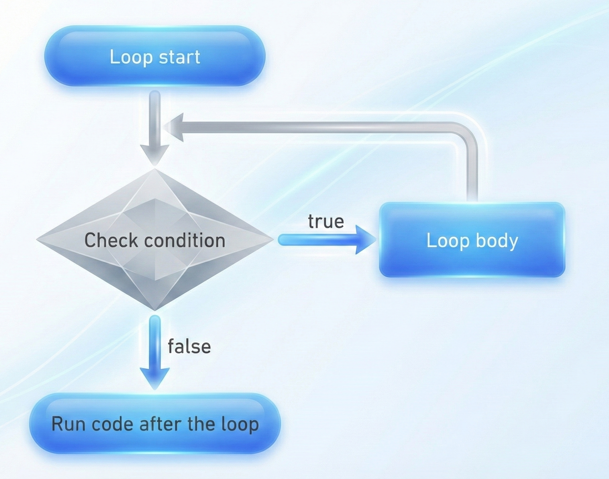
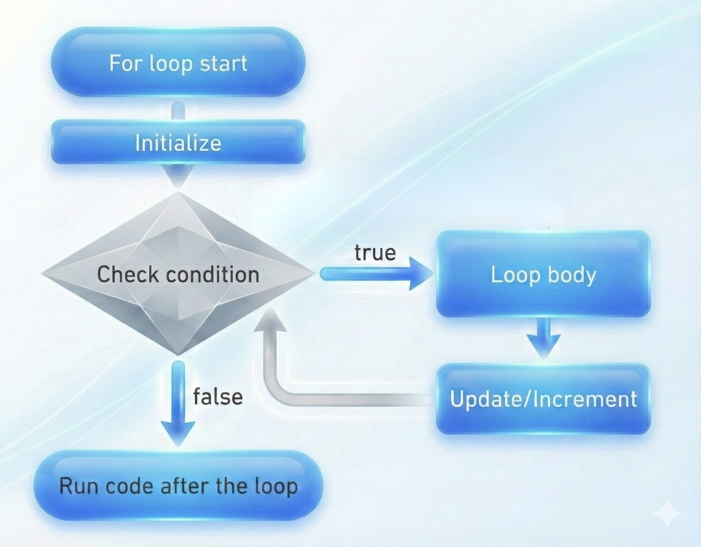
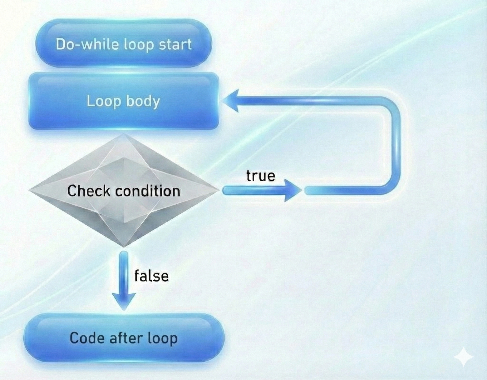

# Loops
In programming a loop is a statement the allow us to run the code multiple times. e.g we need to `console.log` the number from 1 to 10.

### Definition
A loop is a control flow statement that allows a block of code to be executed or run repeatedly based on a specified condition or for a predefined number of iterations.

Loop is just like a circle or start a car race from Point `a`, car run and come again to Point `a` again and again until it stop manually.

<figure>
    
    <figcaption>Loop</figcaption>
</figure>

## Types of Loops
In programming we have three major types of loops:

- `for` loop
- `while` loop
- `do-while` loop

## For loop
A for loop is just a simple loop that repeats a block of code to a specified number of times. 

e.g if we see below code, we need to print the number from 1 to 10, where the no of times is 10.
### Syntax
```js
for (let i = 0; i < 10; i++) {
   // code
   console.log(i); 
}
```

> ### For Loop flow
>
> 1. Initialize the variable (this step will be executed only once before the loop starts)
> 2. Check the condition
> 3. Execute the code
> 4. Update the variable
> 5. Repeat the process until the condition is false
> 
> Now the repeating steps will be `2`, `3`, `4` and `5` until the condition is false.

<figure>
    
    <figcaption>For Loop</figcaption>
</figure>

## While loop

A while loop is just like circle, it repeats a block of code until the condition is false.

### Syntax
```js
while (true) {
    console.log("Hello");
}
```

> ### While loop flow
>
> 1. Check the condition
> 2. Execute the code
> 3. Repeat the process until the condition is false

<figure>
    
    <figcaption>While Loop</figcaption>
</figure>

## Do-While loop

A do-while loop is almost same as while loop, it repeats a block of code until the condition is false but the difference is that it will execute/run the loop body at least once before checking the condition.

### Syntax
```js
do {
    console.log("Hello");
    // code
} while (condition);
```

> ### Do-While loop flow
> 
> 1. Execute the code
> 2. Check the condition
> 3. Repeat the process until the condition is false

<figure>
    
    <figcaption>Do-While Loop</figcaption>
</figure>